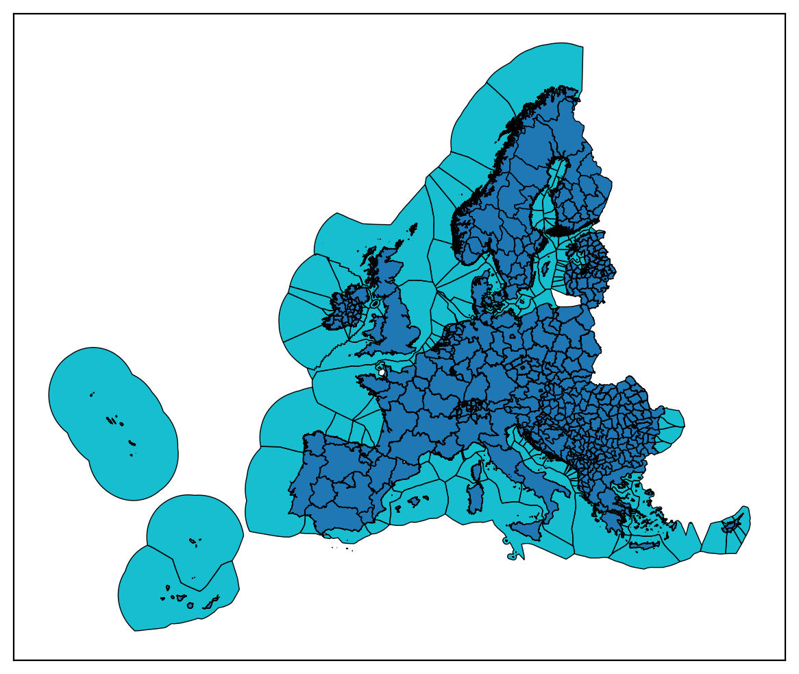
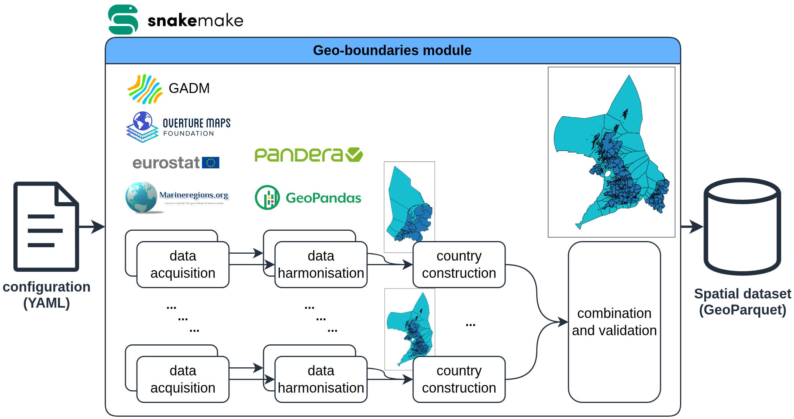

# Modelblocks - Geo-boundaries module

A module to create arbitrary regional boundary datasets for energy systems modelling

<!-- Place an attractive image of module outputs here -->
<p align="center">
  
</p>

## About
<!-- Please do not modify this templated section -->

This is a modular `snakemake` workflow created as part of the [Modelblocks project](https://www.modelblocks.org/). It can be imported directly into any `snakemake` workflow.

For more information, please consult the Modelblocks [documentation](https://modelblocks.readthedocs.io/en/latest/),
the [integration example](./tests/integration/Snakefile),
and the `snakemake` [documentation](https://snakemake.readthedocs.io/en/stable/snakefiles/modularization.html).

## Overview
<!-- Please describe the processing stages of this module here -->

Data processing steps:

<p align="center">
  
</p>


1. For each requested country combination (`scenarios`), the configuration file is read to identify the datasets (`source`) to use as well as the specific countries and subnational aggregation (`subtype`) to process.
    - Country landmass data: [eurostat NUTS](https://ec.europa.eu/eurostat/web/gisco/geodata/statistical-units/territorial-units-statistics), [GADM](https://gadm.org/), [geoBoundaries](https://www.geoboundaries.org/), and [Overture Maps](https://overturemaps.org/) are supported.
    - Exclusive Economic Zone (EEZ) data: [MarineRegions.org](https://www.marineregions.org/).
2. Individual country files are downloaded and harmonised to fit a standardised schema.
    - If identified, contested regions are removed at this stage.
    - Land is clipped using maritime Exclusive Economic Zones (EEZ).
    - Optionally, a Voronoi algorithm is run to separate EEZ areas to fit subnational regions.
3. The country files requested in the scenario are combined and then clipped using their neighbours to minimise overlapping polygons.

> [!TIP] Keep in mind the following
> - The `subtype` naming matches that of the source database. For example, NUTS uses 0, 1, 2 and 3 (NUTS0, NUTS1, NUTS2, etc.).
>Use the references at the bottom of this page for more details.
> - The downloaded data is always kept locally for future re-use.

> [!CAUTION]
> To increase the replicability of your workflow, we recommend using NUTS and geoBoundaries as sources whenever possible as they have more stable hosting methods than Overture Maps and GADM.

## Configuration
<!-- Please describe how to configure this module below -->

Please consult the configuration [README](./config/README.md) and the [configuration example](./config/config.yaml) for a general overview on the configuration options of this module.

## Input / output structure
<!-- Please describe input / output file placement below -->

This module only has one output: a geoparquet file with your requested geo-boundary "shapes" for each of the the configured `scenarios`.

Please consult the [interface file](./INTERFACE.yaml) for more information.

## Development
<!-- Please do not modify this templated section -->

We use [`pixi`](https://pixi.sh/) as our package manager for development.
Once installed, run the following to clone this repository and install all dependencies.

```shell
git clone git@github.com:modelblocks-org/module_geo_boundaries.git
cd module_geo_boundaries
pixi install --all
```

For testing, simply run:

```shell
pixi run test-integration
```

To test a minimal example of a workflow using this module:

```shell
pixi shell    # activate this project's environment
cd tests/integration/  # navigate to the integration example
snakemake --use-conda --cores 2  # run the workflow!
```

## References
<!-- Please provide thorough referencing below -->

This module is based on the following research and datasets.
We encourage users to cite both the original source and our workflow.

- eurostat NUTS (various years). Nomenclature of territorial units for statistics (NUTS).
    - License: reuse is authorised provided the source is acknowledged. <https://ec.europa.eu/eurostat/statistics-explained/index.php?title=Copyright/licence_policy>
- GADM 4.1. (2018). Global Administrative Areas (GADM).
    - License: GADM data is freely available for academic and non-commercial use. <https://gadm.org/license.html>.
- geoBoundaries (most recent version). William & Mary geoLab.
    - License: varies per dataset type (from CC-BY 4.0 compliant to non-commercial use only).
    Consult their documentation for details.
    <https://www.geoboundaries.org/>.
- Marine Regions World EEZ v12 (2023). Flanders Marine Institute (MarineRegions.org).
    - License: CC-By. See <https://www.marineregions.org/disclaimer.php>.
- Overture Maps Divisions database (most recent version). Overture Maps Foundation.
    - License: ODbL. See <https://docs.overturemaps.org/attribution/> and <https://opendatacommons.org/licenses/odbl/summary/> for details.
